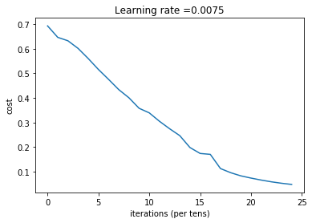
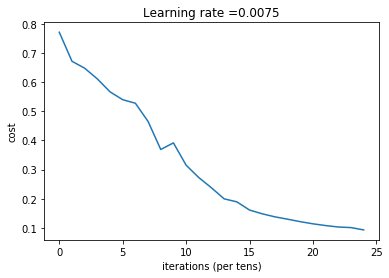
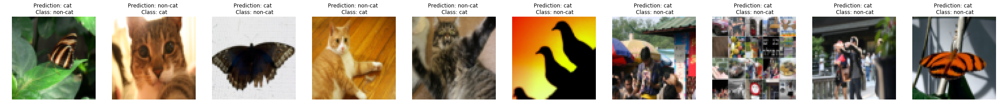

# Image Classification

This project will build and apply a deep neural network to supervised learning of cat vs non-cat classification.

## Packages

To run this project, import all the packages: 

- [numpy](www.numpy.org) is the fundamental package for scientific computing with Python.
- [matplotlib](http://matplotlib.org) is a library to plot graphs in Python.
- [h5py](http://www.h5py.org) is a common package to interact with a dataset that is stored on an H5 file.
- [PIL](http://www.pythonware.com/products/pil/) and [scipy](https://www.scipy.org/) are used here to test your model with your own picture at the end.
- `utils` provides the helper functions for deep neural network.

## Dataset

Now we have dataset("data.h5") containing:

- a training set of m_train images labelled as cat (1) or non-cat (0)
- a test set of m_test images labelled as cat and non-cat
- each image is of shape (num_px, num_px, 3) where 3 is for the 3 channels (RGB).

## Model

We will build two different models:

- A 2-layer neural network
- An L-layer deep neural network

We will also compare the performance of these models.

__General Methodology__

1. Initialize parameters / Define hyperparameters
2. Loop for `num_iterations`:
    a. Forward propagation
    b. Compute cost function
    c. Backward propagation
    d. Update parameters (using parameters, and grads from backprop) 
3. Use trained parameters to predict labels

#### 2-layer neural network

The 2-layer neural network have the following structure: _LINEAR -> RELU -> LINEAR -> SIGMOID_

After train the parameters, following is the result:

```
Cost after iteration 0: 0.6930497356599888
Cost after iteration 100: 0.6464320953428849
Cost after iteration 200: 0.6325140647912677
Cost after iteration 300: 0.6015024920354665
Cost after iteration 400: 0.5601966311605747
Cost after iteration 500: 0.5158304772764729
Cost after iteration 600: 0.47549013139433255
Cost after iteration 700: 0.43391631512257495
Cost after iteration 800: 0.4007977536203886
Cost after iteration 900: 0.3580705011323798
Cost after iteration 1000: 0.3394281538366412
Cost after iteration 1100: 0.3052753636196264
Cost after iteration 1200: 0.2749137728213015
Cost after iteration 1300: 0.24681768210614846
Cost after iteration 1400: 0.19850735037466108
Cost after iteration 1500: 0.17448318112556654
Cost after iteration 1600: 0.17080762978096023
Cost after iteration 1700: 0.11306524562164728
Cost after iteration 1800: 0.09629426845937154
Cost after iteration 1900: 0.08342617959726861
Cost after iteration 2000: 0.07439078704319084
Cost after iteration 2100: 0.06630748132267932
Cost after iteration 2200: 0.05919329501038171
Cost after iteration 2300: 0.053361403485605564
Cost after iteration 2400: 0.04855478562877018
```



- predictions_train: Accuracy: 1.0
- predictions_test: Accuracy: 0.72

#### L-layer Neural Network

The _L_-layer neural network has the following structure: _[LINEAR -> RELU] X (L - 1) -> LINEAR -> SIGMOID_

After train the model as a 5-layer neural network, following is the result:

```
Cost after iteration 0: 0.771749
Cost after iteration 100: 0.672053
Cost after iteration 200: 0.648263
Cost after iteration 300: 0.611507
Cost after iteration 400: 0.567047
Cost after iteration 500: 0.540138
Cost after iteration 600: 0.527930
Cost after iteration 700: 0.465477
Cost after iteration 800: 0.369126
Cost after iteration 900: 0.391747
Cost after iteration 1000: 0.315187
Cost after iteration 1100: 0.272700
Cost after iteration 1200: 0.237419
Cost after iteration 1300: 0.199601
Cost after iteration 1400: 0.189263
Cost after iteration 1500: 0.161189
Cost after iteration 1600: 0.148214
Cost after iteration 1700: 0.137775
Cost after iteration 1800: 0.129740
Cost after iteration 1900: 0.121225
Cost after iteration 2000: 0.113821
Cost after iteration 2100: 0.107839
Cost after iteration 2200: 0.102855
Cost after iteration 2300: 0.100897
Cost after iteration 2400: 0.092878
```



- pred_train: Accuracy: 0.985645933014
- pred_test: Accuracy: 0.8

## Results Analysis

It seems that the 5-layer neural network has better performance (80%) than the 2-layer neural network (72%) on the same test set.

Let's take a look at some images the L-layer model labeled incorrectly. This will show a few mislabeled images.



A few type of images the model tends to do poorly on include:

- Cat body in an unusual position
- Cat appears against a background of a similar color
- Unusual cat color and species
- Camera Angle
- Brightness of the picture
- Scale variation (cat is very large or small in image)